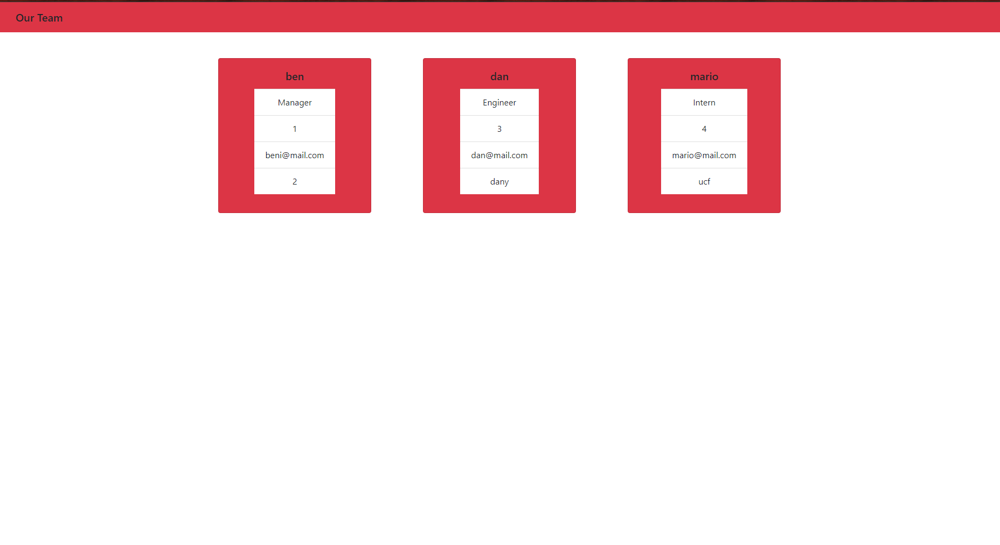

# manyportfolios
  

- [Installation](#installation)

- [Usage](#usage)

- [Contribution](#contributing)

- [License](#license)

## License

an application to showcase your employees organized by job title 

[click me to view the walkthrough video](https://drive.google.com/file/d/1RQQx3GoA8Oo_4jgnK1Z4H7peU2HyHRvh/view)

## Installation

simply download the files and run it on your node server

## Usage

enter the information about your employees and enjoy a polished website containing information about your company

## Contributing

please do not contribute

## Testing

follow the test files in the test folder and run "npm test" for each

## Questions

Contact me!

Github: https://github.com/azrazel95

Email: beni.sprenger@hotmail.com

